# Hospital-Website-Audit-Dashboard
Website Audit Dashboard for Best Hospital in India (Self Learning Project).

# 🏥 Hospital SEO Audit Dashboard

This project is part of my *Self-Learning Journey in SEO & Web Analytics*.  
I audited the top 3 hospital websites ranking for the keyword *“Best Hospital in India”* and built an interactive dashboard to visualize the findings.

---

## 🔎 Project Overview
- *Objective*: To understand SEO metrics by auditing real-world websites.  
- *Keyword Used*: "Best Hospital in India"  
- *Websites Analyzed*:  
  1. Newsweek  
  2. Max Healthcare  
  3. Fortis Healthcare  

---

## ⚙️ Tools & Methodology
- *WHOIS.com* → Domain Age  
- *DAPA Checker* → Domain & Page Authority  
- *Ahrefs Backlink Checker* → Backlinks & Traffic  
- *Google PageSpeed Insights* → Speed & Performance  
- *Pingdom Tools* → Load Time  
etc.
---

## 📊 Key Insights
- *Best Performing Website*: Max Healthcare (High traffic & perfect speed).  
- *Weakest Website*: Fortis Healthcare (Low backlinks & slow loading speed).  
- *Improvement Areas*:
  - Fortis → Improve backlinks & mobile friendliness.  
  - Newsweek → Optimize page authority.  
  - All sites → Better technical SEO consistency.  

---

## 📂 Project Files
You can view/download the presentation here:  
- 📑 [Hospital Website Auditing – PDF](./hospital-website-auditing-best-hospitals-in-india.pdf)  
- 🎞️ [Hospital Website Auditing – PPTX](./hospital-website-auditing-best-hospitals-in-india.pptx)

---

## 🖼️ Dashboard Preview
- Dashboard Preview 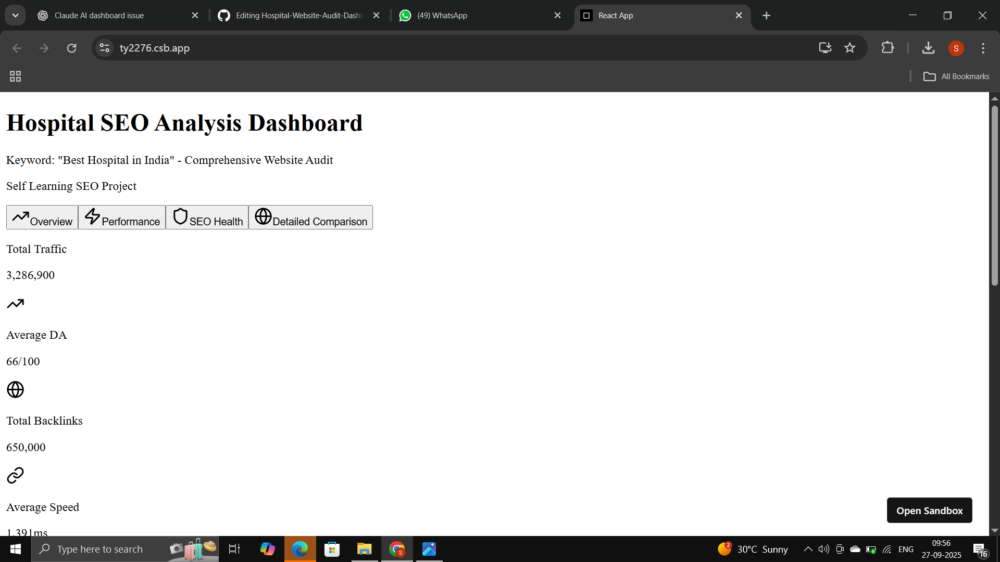
👉 [*Live Demo on CodeSandbox*](https://ty2276.csb.app/)  

---

## 🎥 Behind the Scenes (BTS)
I documented the full process — from research to building visuals.
- 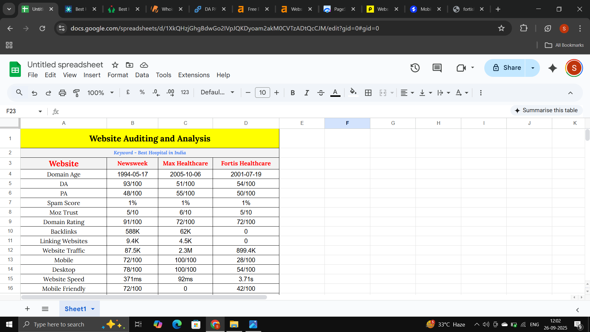
- 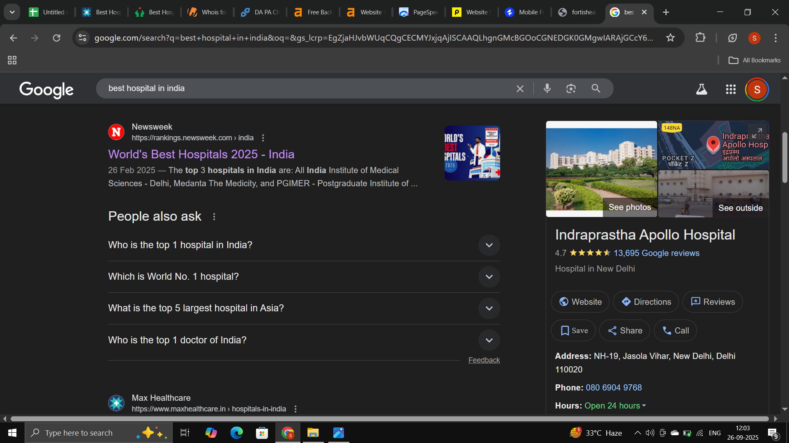
- 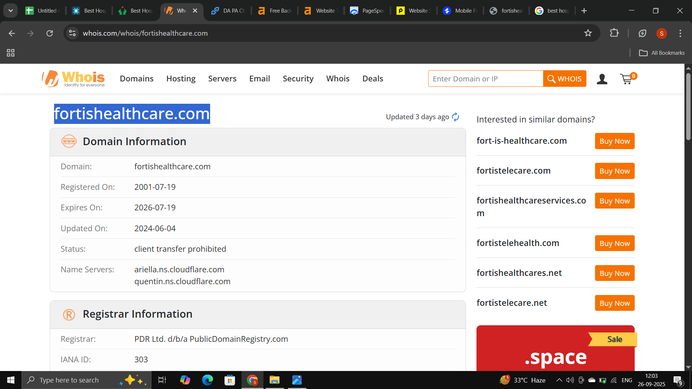
- 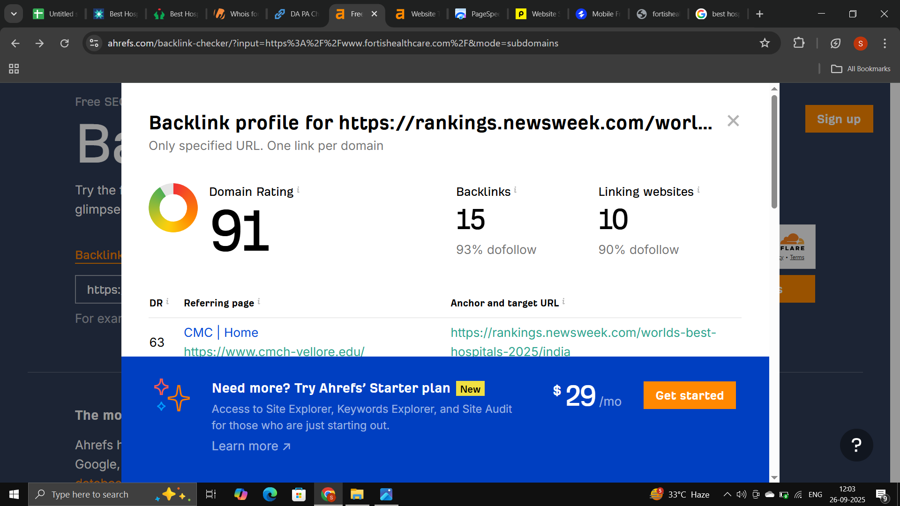
- 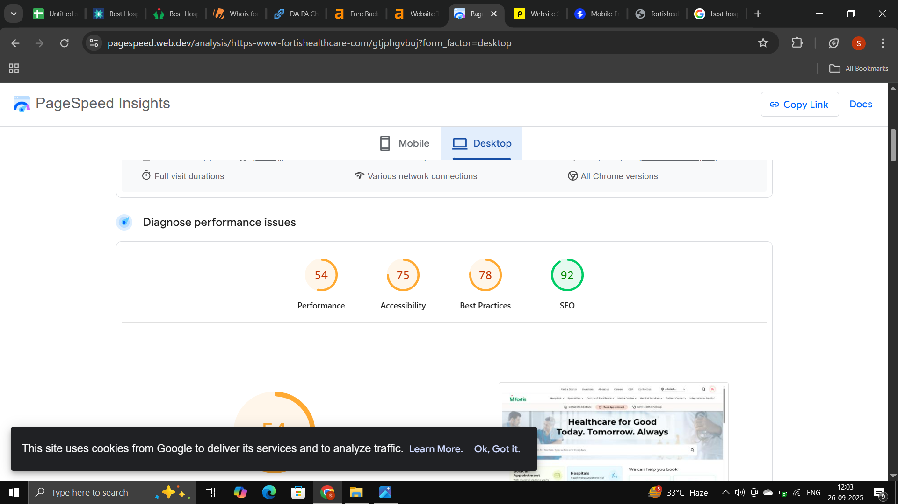
- 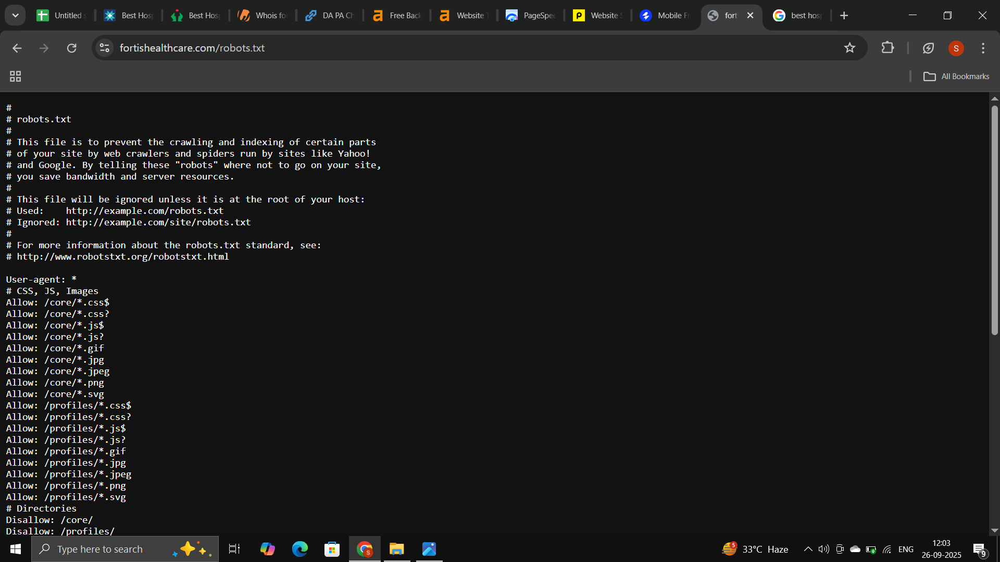
- 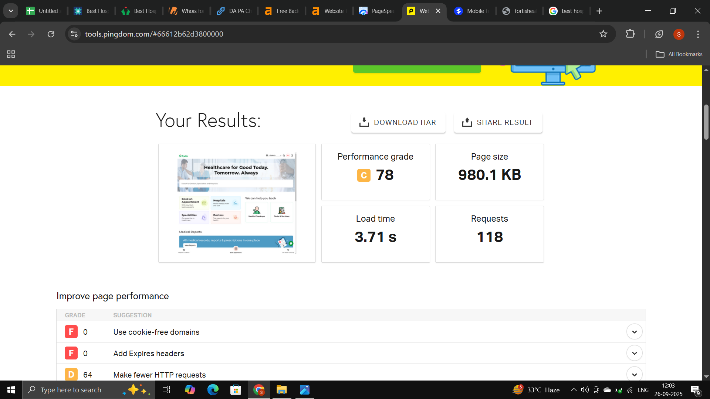
- 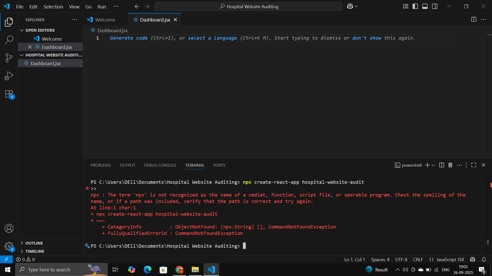
- 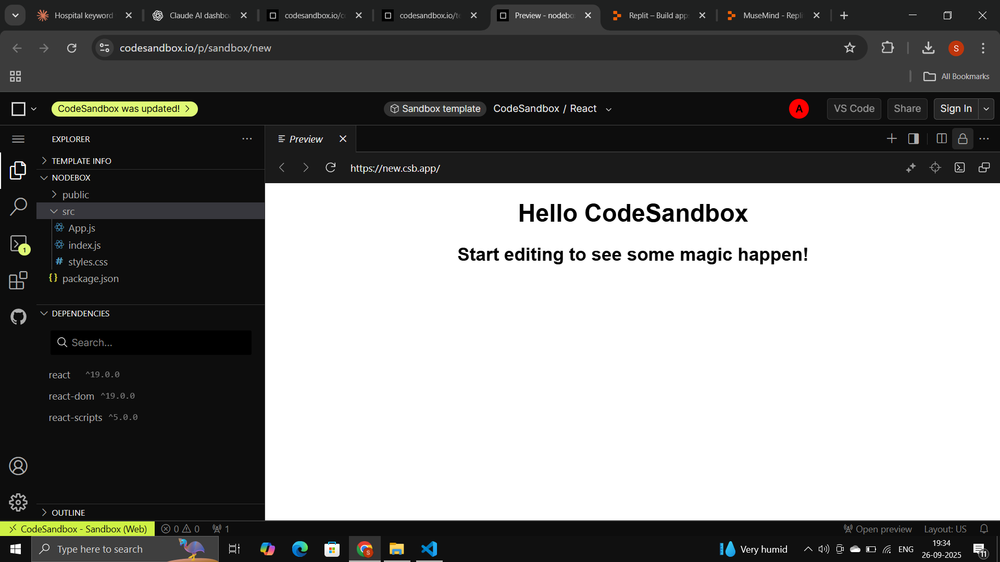
- 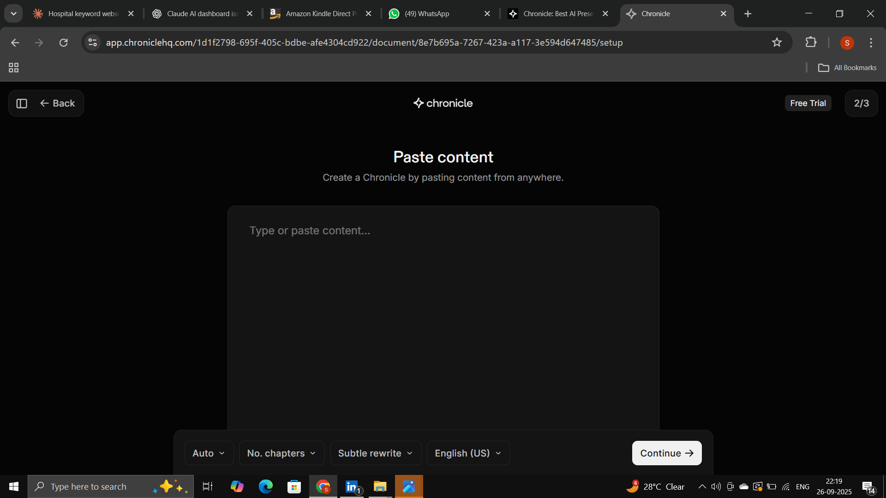

🔗 Made by Sachin Chaudhary
- 💼 [LinkedIn](https://www.linkedin.com/in/sachindecodes)  
- 📧 [E-mail](mailto:sachinofficial1967@gmail.com)  
- 🌐 [Portfolio](https://sachin-chaudhary-l2vbqho.gamma.site/)

---

## 📌 Project Scope
- Practical SEO Learning  
- Data Visualization using React + Recharts  
- Building portfolio-ready project  

---

## 🙏 Thank You
This is a part of my continuous self-learning.
